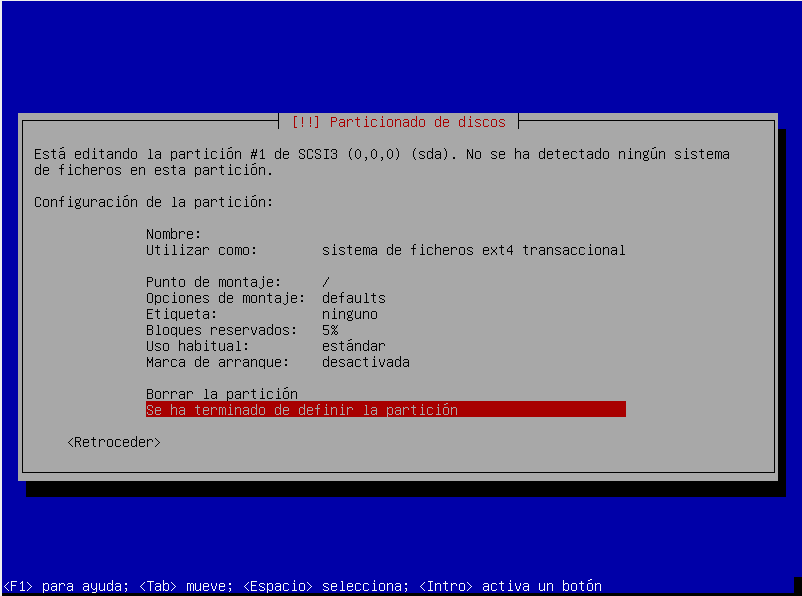

# Instalacion de debian con configuracion de servidores

### Antes de iniciar
----
Hay que recalcar que esta instalación se llevará acabo desde consola en modo experto, tiene una especie de interfaz grafica en consola que nos ayudará.
en este repo deberia de haber un archivo con un listado de comandos basicos para poder manejar la consola, así que no se asusten, al consola es mas docil de lo que aparenta. 

### instalación
----
_(en el instalador nos tendremos que mover con el teclado las flechas para movernos entre las opciones, enter para seleccionar y tabulador para pasar entre instrucciones)_
1.- Una vez booteamos nuestra imagen de debian nos deberia de salir un menú donde se nos muestran diferentes opciones, como por ejemplo:
- Graphical install
- install
- advanced options
entre otras pero la que nos interesa es exactamente esa ultima: Advanced options.
Le damos _Enter_ y nos llevará a la siguiente pantalla donde se nos mostraran mas opciones de como poder instalar debian, la que nos interesa es la que dice _Expert install_, no confundir con la _Graphical expert install_.
_(quiero hacer un parentesís para aclarar que lo hacemos desde el "modo feo" ya que es mas flexible con las opciones y nos deja ver con mas transparencia que ocurre tambien por el hecho de que el modo experto grafico puede que instale programas no deseados, nosotros buscamos una instalacion limpia de debian, sin entorno grafico para el ahorro de recursos ni  software adicional que no nos sirva para administrar nuestro server: la instalación modo experto nos permite saltarnos pasos que es muy importante, ademas de que si te ves bien experto instalandolo desde la interfaz de consola claro que si)_.
Le daremos nuevamente _Enter_ a la opcion _Expert install_ y nos llevará al instalador ahora si.

2.- Ya en el instalador tendremos un listado de cosas por configurar y mediante vayamos configurando nuestro debian irán saliendo mas que se necesitarán configurar pero no se preocupen que se verán todas las cuestiones mas relevantes de la instalación.

## dentro del instalador
----
el instalador en modo experto deberia de lucir así:

### Choose languaje: 
necesitamos especificar el lenguaje con el que queremos que esté nuestra instalacion, si se le da enter desplegará un menú con lenguajes, busque usted el de su prefencia igual los errores y los archivos siempre van a estar en ingles asi que jaja solo funciona en el instalador.

- despues de seleccionar su idioma se le solicitará una ubicacion de donde se encuentra, seleccione el pais en el que se encuentra
- siguiente de esto aparecerá otra ventana que ofrecerá una variedad de localizaciones, por lo regular según lo que seleccionó anteriormente le recomendará una opcion por default (la mia es mexico es_MX.UTF-8), busque la que mas se adapte a su instalación y presione _Enter_ para confirmar su selección

- despues de confirmar su lenguaje le preguntará si quiere añadir otro lenguaje (linux puede manejar distintos lenguajes al mismo tiempo) pero saltaremos esa opcion, presione tabulador hasta que la flecha que dice _continuar_ aparezca seleccionada y dele _Enter_

### Configure el teclado
_los pasos que no aparezcan en este documento, salteselos porque no nos interesan esas configuraciones_

- Seleccione la distribución del teclado que tenga en su computadora, en este caso nosotros utilizaremos el _Latinoamericano_

### Detectar y montar el medio de instalación
este paso resulta casi automatico ya que solo necesitaremos indicarle el medio donde se encuentran todos los elementos que se instalarán, en este caso nosotros tenemos el archivo que descarga todo de internet.

solo le daremos _Enter_ y nos aparecerá otra ventana donde avisa que encontró el medio de instalación, solo de daremos _Enter_ tambien y seguiremos con la instalación

### Cargar componentes del instalador desde los medios de instalación

Esta opción es la que nos cargará todo desde el montaje que seleccionamos en el paso anterior, le daremos _Enter_
Aparecerá una ventana con varios componentes, estos componentes son extras por si desea añadir algo mas a la instalación, no será necesario asi que pasaremos a el boton de continuar con el tabulador y daremos _Enter_(se me olvidó tomar captura jajajajaja).
Cargara una barra y verá que ahora en el instalador tiene mas pasos.

### deteccion del hardware de red

Otro paso de tramite ya que solo mostrará una barra de carga mientras detecta nuestro hardware de red.

### configurar la red

este paso es automatico asi que solo daremos _Enter_
Se configurará con DHCP lo cual nos dará una configuracion para negociar una ip de manera dinamica (estudiar que es el DHCP), cuando termine la instalación configuraremos la red para quedarnos con una ip estatica (ya que es lo que deberia de tener un servidor, una i que no cambie).

Saldrá otra ventana y le daremos solamente _Enter_
esperamos a que termine de configurar la red y nos solicitará un nombre para nuestra maquina.
_paso muy importante denle un nombre chido y quieran mucho a su server, el es su amigo, uno que le traera muchos problemas_
yo le pondre _Kitakaze_ pues porque soy otaku

Aparecerá la siguiente ventana en la cual no pondremos nada, solamente daremos _Enter_

### Configurar usuarios y contraseñas

en este paso nos detendremos a configurar al usuario root (super usuario o usuario administrador) es muy importante tener una contraseña segura, ya que los ataques al puerto del ssh (se verá en otro documento) están a la orden del dia como los famosos ataques de diccionario.
Piense en una contraseña segura para su super usuario y guardela celosamente, no la comparta con nadie.

la primera ventana que nos aparece es para una cuestion de seguridad, menciona si quieres que se habilite las contraseñas ocultas (recomendable seleccionar si)
Basicamente lo que hace esta configuracion es que cuando escribamos contraseñas no aparezca nada en pantalla por cuestiones de seguridad.

La siguiente ventana menciona si queremos permitir el acceso como root, le daremos que si ya que un servidor se maneja con la cuenta de super usuario para poder manipular todos los archivos (estudiar permisos y usuarios en linux).

Nos solicitará una contraseña para root, escriba la contraseña segura que pensó para su usuario root

la siguiente ventana nos dice que si queremos añadir un nuevo usuario normal, le diremos que no por el momento, pero despues añadiremos uno cuando tengamos debian instalado.

### Configurar el reloj

en este paso aparecerá que si queremos utilizar NTP para configurar la hora, le diremos que si

saldrá una ventana que te preguntará por un servidor del cual tome la informacion, le daremos _Enter_ para continuar.

se terminará de configurar y nos preguntará nuestra zona horaria, en este caso la mia es central asi que pondré esa.

### Detectar discos

Este es otro paso de tramite, solo presione enter y espere a que termine

### particionado de discos

Este paso es importante y es el que se deberia de planificar bien para futuras expansiones en el almacenamiento, existen diferentes configuraciones para esto, desde separar las carpetas de home en un disco y lo de root en otro, en este caso iremos por algo basico pero considere buscar particionados optimos para servidores o el uso de LVM.

Aparecerá una ventana como esta:

seleccionaremos la primera opción
solo tenemos un disco asi que en la siguiente pantalla solo aparecerá ese:

seleccionaremos ese disco
nos pedirá crear una tabla de particiones asi que le diremos que si.
(si aparece una opcion que diga "para novatos" seleccione esa ya que es la configuracion mas basica, si hubiera mas discos o tendriamos en cuenta permisos por particion entonces deberiamos de considerar otro particionado, una vez que haya hecho esto se saltará los siguientes pasos, si no aparece siga los pasos que vienen a continuacion)

Seleccionaremos la opcion gpt:

nos aparecerá una ventana con nuestro disco y una parte que dice "espacio libre"
seleccione la que dice "espacio disco" debajo de su disco y presione _Enter_

En la siguiente ventana seleccionaremos la opcion que dice "crear una partición nueva"
aparecerá una ventana donde le pedirá que especifique el tamaño de dicha particion, por default aparece el espacio total, para efectos de este tutorial lo dejaremos asi, una particion del tamaño completo del disco

aparecerá un formulario siguiente de esto, deje todo como está y seleccione "se ha terminado de definir la partición"

Quedarán algunos megas libres pero eso ya es por configuracion del sistema operativo, igual no es un tamaño significativo.

seleccione "finalizar el particionado y escribir los cambios en el disco":

Aparecerá un mensaje que dice que no hemos seleccionado area de intercambio (o swap)
para esta instalación no usaremos pero revise en que casos es necesario o si desea solo añadalo en pasos anteriores, de momento en la ventana siguiente seleccioanremos "no".

siguiente de eso se nos presentara un resumen de como quedarian nuestras particiones para verificar que todo esté correcto:

### Instalar el sistema base

este es otro paso de tramite solo presione enter y espere a que se instale todo el sistema

###
