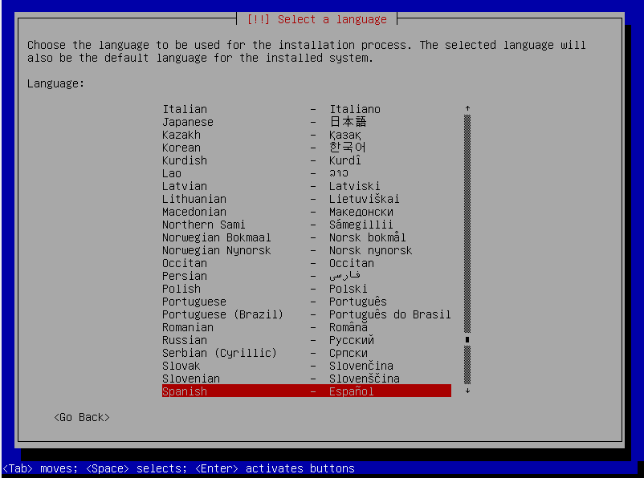

# Instalacion de debian con configuracion de servidores

- No encontré manera de adjuntar imagenes en esto asi que va a ir a puro texto

### Antecedentes
----
Hay que recalcar que esta instalación se llevará acabo desde consola en modo experto, tiene una especie de interfaz grafica en consola que nos ayudará.
en este repo deberia de haber un archivo con un listado de comandos basicos para poder manejar la consola, así que no se asusten, al consola es mas docil de lo que aparenta. 

### instalación
----
_(en el instalador nos tendremos que mover con el teclado las flechas para movernos entre las opciones, enter para seleccionar y tabulador para pasar entre instrucciones)_
1.- Una vez booteamos nuestra imagen de debian nos deberia de salir un menú donde se nos muestran diferentes opciones, como por ejemplo:
- Graphical install
- install
- advanced options
entre otras pero la que nos interesa es exactamente esa ultima: Advanced options.
Le damos _Enter_ y nos llevará a la siguiente pantalla donde se nos mostraran mas opciones de como poder instalar debian, la que nos interesa es la que dice _Expert install_, no confundir con la _Graphical expert install_.
_(quiero hacer un parentesís para aclarar que lo hacemos desde el "modo feo" ya que es mas flexible con las opciones y nos deja ver con mas transparencia que ocurre tambien por el hecho de que el modo experto grafico puede que instale programas no deseados, nosotros buscamos una instalacion limpia de debian, sin entorno grafico para el ahorro de recursos ni  software adicional que no nos sirva para administrar nuestro server: la instalación modo experto nos permite saltarnos pasos que es muy importante, ademas de que si te ves bien experto instalandolo desde la interfaz de consola claro que si)_.
Le daremos nuevamente _Enter_ a la opcion _Expert install_ y nos llevará al instalador ahora si.

2.- Ya en el instalador tendremos un listado de cosas por configurar y mediante vayamos configurando nuestro debian irán saliendo mas que se necesitarán configurar pero no se preocupen que se verán todas las cuestiones mas relevantes de la instalación.

## dentro del instalador
----
el instalador en modo experto deberia de lucir así:

### Choose languaje: 
necesitamos especificar el lenguaje con el que queremos que esté nuestra instalacion, si se le da enter desplegará un menú con lenguajes, busque usted el de su prefencia igual los errores y los archivos siempre van a estar en ingles asi que jaja solo funciona en el instalador.

- despues de seleccionar su idioma se le solicitará una ubicacion de donde se encuentra, seleccione el pais en el que se encuentra
- siguiente de esto aparecerá otra ventana que ofrecerá una variedad de localizaciones, por lo regular según lo que seleccionó anteriormente le recomendará una opcion por default (la mia es mexico es_MX.UTF-8), busque la que mas se adapte a su instalación y presione _Enter_ para confirmar su selección

- despues de confirmar su lenguaje le preguntará si quiere añadir otro lenguaje (linux puede manejar distintos lenguajes al mismo tiempo) pero saltaremos esa opcion, presione tabulador hasta que la flecha que dice _continuar_ aparezca seleccionada y dele _Enter_

### Configure el teclado
_los pasos que no aparezcan en este documento, salteselos porque no nos interesan esas configuraciones_

- Seleccione la distribución del teclado que tenga en su computadora, en este caso nosotros utilizaremos el _Latinoamericano_

### Detectar y montar el medio de instalación
este paso resulta casi automatico ya que solo necesitaremos indicarle el medio donde se encuentran todos los elementos que se instalarán, en este caso nosotros tenemos el archivo que descarga todo de internet.

solo le daremos _Enter_ y nos aparecerá otra ventana donde avisa que encontró el medio de instalación, solo de daremos _Enter_ tambien y seguiremos con la instalación

### Cargar componentes del instalador desde los medios de instalación

Esta opcion es la que nos 
